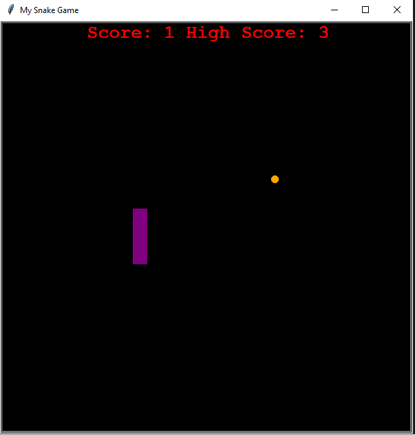

# SnakeGameProject

This project involved the development of the timeless Snake game. 
Utilizing the turtle Python Library, I crafted this edition of the game. 
Another important part of this project, is that it was created using Objected Oriented Programming.

Example picture of finished product:

